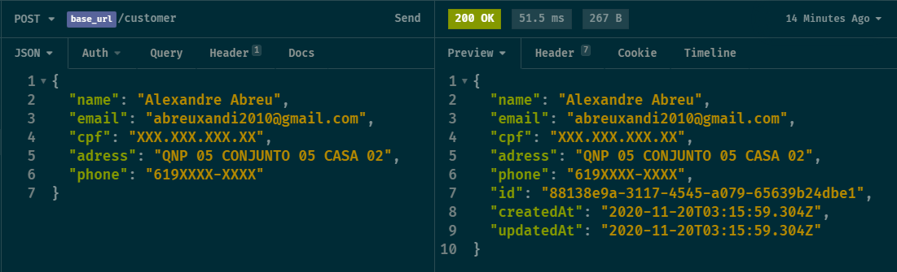
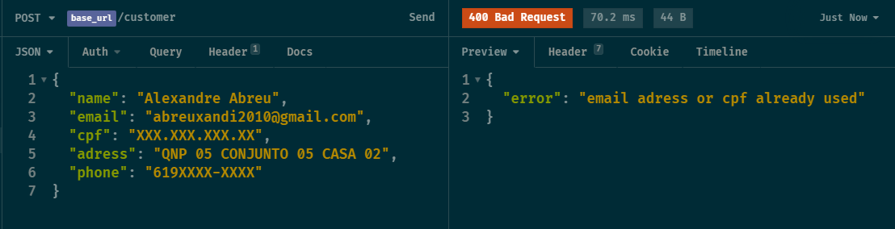

# OrmConfig.json

Aqui é feita algumas configurações do banco como tipo, nome e etc..

# Customer

## Criação

### Verificações

- São feitas antes de serem enviadas para o banco.
- Email e CPF já cadastrados:

## Atualizações futuras

- Criar uma tabela separada para Adress para facilitar no futuro a análise de dados
- Login para Customer verificar suas reservas
